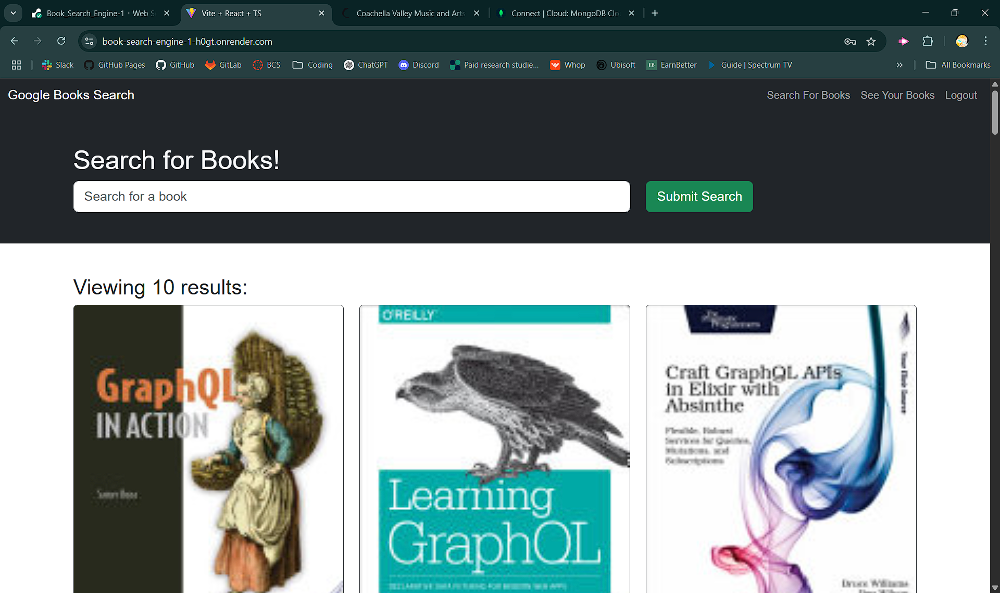

# 📚 Google Books Search Engine

A full-stack MERN application using **Apollo Server**, **GraphQL**, **MongoDB**, and **JWT authentication**, where users can search for books via the Google Books API, save them to their profile, and manage their saved collection.

> 🧠 Built with love and TypeScript. Deployed with Render. As of April 08, 2025, all features are working beautifully.

---

## 🚀 Features

### 🔍 Book Search
- Search books using Google Books API
- View cover, title, authors, and description
- Clean responsive UI powered by React + Bootstrap

### 💾 Save & Manage Books
- Save books to your user profile
- Delete books from your saved list
- Prevent duplicate saves
- See saved books on the `/saved` route

### 🔐 Authentication
- Create account (signup)
- Log in using email/password
- Token-based authentication via JWT
- Authenticated mutations protected with middleware
- Book saving/removal only available to logged-in users

---

## 🧱 Tech Stack

| Layer      | Tech                                                     |
|------------|----------------------------------------------------------|
| Frontend   | React, TypeScript, Apollo Client, Bootstrap              |
| Backend    | Node.js, Express, Apollo Server v4, GraphQL              |
| Database   | MongoDB, Mongoose                                        |
| Auth       | JWT, bcrypt                                              |
| APIs       | Google Books API                                         |
| Deployment | Render (Frontend + Backend)                              |

---

## 🧩 Project Structure

```
📦 Book_Search_Engine
├── client
│   ├── src
│   │   ├── components (forms, navbar)
│   │   ├── pages (SearchBooks, SavedBooks)
│   │   ├── utils (auth, mutations, queries, localStorage)
│   └── ...
├── server
│   ├── models (User, Book)
│   ├── schemas (typeDefs, resolvers)
│   ├── services (auth token helper)
└── ...
```

---

## ✅ Completed Features Checklist

- [x] Google Books API integration
- [x] Apollo Client setup with Auth headers
- [x] Apollo Server with context and resolvers
- [x] `BookInput` and `UserInput` GraphQL schema types
- [x] `saveBook` & `removeBook` mutations
- [x] `GET_ME` query for user profile and savedBooks
- [x] JWT authentication with token verification
- [x] Save to/remove from `localStorage`
- [x] Deployed to Render

---

## 🛠️ Installation & Setup

```bash
git clone https://github.com/your-username/book-search-engine.git
cd book-search-engine

# Install server deps
cd server
npm install

# Install client deps
cd ../client
npm install

# Start development mode
npm run dev
```

> Be sure to create a `.env` file in the server with:
```
MONGODB_URI=your_mongo_uri
JWT_SECRET=your_secret
```

---

## 🌐 Live Demo

 

**Frontend**: [https://book-search-engine-ygm6.onrender.com](https://book-search-engine-ygm6.onrender.com)

---

## 💡 Inspiration

This project was built as part of a full-stack bootcamp assignment to practice:

- GraphQL schemas & resolvers
- Secure JWT authentication
- Apollo Client for React
- Integration with third-party APIs
- Full-stack deployment with CI/CD mindset

---

## 🧠 Author

**Carmen Wheeler**  
_Developer • Debugger • Design Enthusiast_  
💬 Let's build something cool together.

---

## 📬 Contact

Got questions or feedback? Reach out:

- 📧 **Email**: carmenwh33l3r@gmail.com  
- 🐙 **GitHub**: [@Oustsideofemit](https://github.com/Oustsideofemit)

---

## 📄 License

MIT © April 08, 2025
